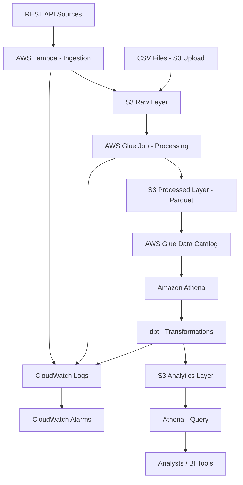

# AWS Architecture Design

## Architecture Overview



## AWS Service Justification

### S3 - Data Lake Storage

**Purpose**: All data storage (raw, processed, analytics)

**Why needed**:
- Durable object storage (11 9s durability)
- Virtually unlimited scale
- Pay only for storage used
- Native integration with Glue, Athena
- Lifecycle policies for cost control
- Immutable raw data preservation

**Alternatives considered**:
- RDS: Not suitable for analytical workloads, fixed capacity
- DynamoDB: Wrong access pattern, cost inefficient for analytics
- EBS: Requires compute instances, not serverless

**Decision**: S3 is the foundational service for cloud data lakes. Non-negotiable.

**Cost profile**: ~$0.023/GB/month standard storage, ~$0.01/GB/month Intelligent-Tiering

### Lambda - Ingestion

**Purpose**: Serverless REST API data ingestion

**Why needed**:
- No always-on compute cost
- Automatic scaling
- Event-driven architecture
- Sub-second response time sufficient for batch ingestion
- Python runtime for data processing

**Alternatives considered**:
- EC2: Continuous cost, over-provisioned for batch workload
- ECS/Fargate: More complex, overkill for simple HTTP requests
- Glue Python Shell: Slower cold start, designed for longer jobs

**Decision**: Lambda fits serverless batch ingestion pattern. Runs only when invoked (scheduled or manual).

**Cost profile**: 1M free requests/month, then $0.20/1M requests + $0.0000166667/GB-second

### Glue - ETL Processing

**Purpose**: Transform raw JSON/CSV to Parquet, maintain Data Catalog

**Why needed**:
- Serverless ETL, pay per job run
- Native Parquet conversion
- Integrated Data Catalog for Athena
- PySpark for distributed processing if volume grows
- Crawlers for schema discovery

**Alternatives considered**:
- Lambda: 15min timeout insufficient for large transformations, limited memory
- EMR: Persistent cluster cost, overkill for current volume
- Local Python + Athena: No transformation orchestration, manual schema management
- Step Functions + Lambda chain: More complex, less purpose-built for ETL

**Decision**: Glue provides serverless ETL with catalog integration. Python shell jobs sufficient for current volume (10K orders/day), can upgrade to PySpark if needed.

**Cost profile**: $0.44/DPU-hour (Python shell = 1 DPU)

### Athena - Query Engine

**Purpose**: SQL interface to S3 data lake

**Why needed**:
- Serverless query, pay per TB scanned
- Standard SQL (Presto-based)
- dbt-athena adapter exists
- Direct S3 access, no data loading
- Partition pruning reduces cost

**Alternatives considered**:
- Redshift: Persistent cluster cost (~$180/month minimum), overkill for volume
- Redshift Serverless: Still $300/month+ usage, excessive for portfolio
- Direct S3 access with pandas: No SQL interface, not multi-user

**Decision**: Athena is cost-effective for analytical query workload. Only pay when querying.

**Cost profile**: $5/TB scanned. With partitioning and Parquet, typical query scans <1GB = $0.005/query

### Glue Data Catalog

**Purpose**: Centralized metadata store for tables/schemas

**Why needed**:
- Athena requires catalog for table definitions
- dbt uses catalog to discover schemas
- Schema versioning and evolution tracking
- Partition metadata for query optimization

**Alternatives considered**:
- Manual Athena DDL: No version control, error-prone
- Hive Metastore on EC2: Persistent cost, operational overhead

**Decision**: Glue Catalog is AWS-managed, serverless, required for Athena integration.

**Cost profile**: First 1M objects free, $1/100K objects after

### CloudWatch - Observability

**Purpose**: Logs, metrics, alarms

**Why needed**:
- Native AWS service integration (Lambda, Glue auto-log)
- Centralized log aggregation
- Custom metrics from application code
- Alarm creation for failure detection
- Log retention control for cost

**Alternatives considered**:
- Third-party APM (Datadog, New Relic): Excessive cost for portfolio
- Self-hosted ELK: Operational overhead, persistent cost
- No monitoring: Unacceptable for production-grade demonstration

**Decision**: CloudWatch is included with AWS, sufficient for observability requirements.

**Cost profile**: $0.50/GB ingested, $0.03/GB stored. Control with log retention policies (7-14 days).

### Terraform - Infrastructure as Code

**Purpose**: Manage all AWS resources as code

**Why needed**:
- Reproducible infrastructure
- Version-controlled infrastructure changes
- Prevent manual AWS console drift
- Environment consistency
- Destroy/recreate capability for cost control

**Alternatives considered**:
- CloudFormation: AWS-native but verbose, YAML limitations
- CDK: Requires additional language complexity
- Manual console: Not production-grade, not portfolio-appropriate
- Pulumi: Less industry standard than Terraform for AWS

**Decision**: Terraform is industry standard IaC for multi-cloud. HCL is purpose-built for infrastructure.

**Cost profile**: Free (open source)

## Services NOT Included

### Not using Kinesis/Kinesis Firehose
**Reason**: Not a real-time streaming platform. Batch ingestion with Lambda is simpler and cheaper.

### Not using Step Functions
**Reason**: Current pipeline is linear (Lambda → S3 → Glue → Athena). Step Functions add complexity without current value. Consider if orchestration needs grow.

### Not using EMR
**Reason**: Volume does not justify distributed compute. Glue Python shell jobs sufficient. EMR = persistent cluster cost.

### Not using RDS/Aurora
**Reason**: Analytical workload, not transactional. S3 + Athena eliminates database operational overhead.

### Not using API Gateway
**Reason**: Lambda invoked on schedule (EventBridge), not via HTTP endpoint. API Gateway unnecessary.

### Not using SQS/SNS
**Reason**: No async message requirements yet. Direct Lambda → S3 is simpler. Consider if retry logic needs decouple.

### Not using ECS/Fargate/EKS
**Reason**: No containerized workload requirements. Lambda + Glue are serverless alternatives.

## S3 Data Lake Architecture

```
s3://cloudlake-data-{account_id}/
│
├── raw/
│   ├── customers/
│   │   └── year=YYYY/month=MM/day=DD/
│   │       └── {timestamp}_{run_id}.json
│   ├── products/
│   │   └── year=YYYY/month=MM/day=DD/
│   │       └── {timestamp}_{run_id}.json
│   ├── orders/
│   │   └── year=YYYY/month=MM/day=DD/
│   │       └── {timestamp}_{run_id}.json
│   ├── order_items/
│   │   └── year=YYYY/month=MM/day=DD/
│   │       └── {timestamp}_{run_id}.json
│   └── stores/
│       └── year=YYYY/month=MM/day=DD/
│           └── {timestamp}_{run_id}.csv
│
├── processed/
│   ├── customers/
│   │   └── year=YYYY/month=MM/day=DD/
│   │       └── part-*.parquet
│   ├── products/
│   │   └── year=YYYY/month=MM/day=DD/
│   │       └── part-*.parquet
│   ├── orders/
│   │   └── year=YYYY/month=MM/day=DD/
│   │       └── part-*.parquet
│   ├── order_items/
│   │   └── year=YYYY/month=MM/day=DD/
│   │       └── part-*.parquet
│   └── stores/
│       └── year=YYYY/month=MM/day=DD/
│           └── part-*.parquet
│
└── analytics/
    ├── staging/
    │   ├── stg_customers/
    │   ├── stg_products/
    │   ├── stg_stores/
    │   ├── stg_orders/
    │   └── stg_order_items/
    ├── dimensions/
    │   ├── dim_customer/
    │   ├── dim_product/
    │   └── dim_store/
    ├── facts/
    │   └── fact_order/
    └── marts/
        ├── mart_daily_sales/
        ├── mart_product_performance/
        ├── mart_customer_metrics/
        └── mart_store_performance/
```

### Layer Descriptions

**raw/**: Immutable source data preservation
- Original format (JSON from API, CSV from upload)
- Date partitioned for lifecycle policies
- Timestamped filenames prevent overwrites
- Run ID tracks ingestion execution
- Never modified after write
- Retention: 90 days (configurable)

**processed/**: Cleaned, typed, Parquet format
- Glue job output
- Columnar storage for analytical queries
- Snappy compression
- Date partitioned for query pruning
- Schema enforced
- Reproducible from raw layer
- Retention: 1 year (configurable)

**analytics/**: dbt transformation output
- Business logic applied
- Denormalized for query performance
- Optimized for specific analytical questions
- Date partitioned
- Retention: Indefinite (small volume)

### Partitioning Strategy

**Date partitioning (year/month/day)**:
- Enables partition pruning in Athena
- Aligns with typical analytical queries (recent data)
- Supports lifecycle policies
- S3 prefix structure enables parallel processing

**Not using hourly partitioning**:
- Batch frequency is daily
- Adds S3 prefix depth without query benefit
- Increases catalog size

**Not using Hive-style partitioning for all fields**:
- Customer/product/store partitions would create excessive small files
- Date is the primary query filter
- Other filters handled by Parquet column pruning

### Naming Conventions

**Bucket**: `cloudlake-data-{account_id}` (ensures global uniqueness)

**File naming**:
- Raw: `{timestamp}_{run_id}.{format}` (ISO 8601 timestamp + UUID run_id)
- Processed: Glue-generated part files
- Analytics: dbt-generated partition structure

### Immutability

**Raw layer**: Write-once, never update. New ingestion = new file.

**Processed layer**: Overwrite mode for daily partitions. Reprocessing replaces partition.

**Analytics layer**: dbt full-refresh or incremental strategy. Models control mutability.

### Object Key Design

Keys include entity and date to enable:
- S3 lifecycle policies per prefix
- Glue crawler targeting
- Access control by entity
- Cost tracking by entity

### Compression

**Raw**: None (source format preserved)

**Processed**: Snappy (balance compression ratio vs query speed)

**Analytics**: Snappy (optimized for Athena query performance)

## Data Flow

### Ingestion Flow (API Data)

```
External API
    ↓ HTTP GET (scheduled via EventBridge)
Lambda Function (Python)
    ↓ Validate response
    ↓ Extract JSON
    ↓ Add ingestion metadata (timestamp, run_id)
S3 Raw Layer
    ↓ S3 event (optional) or scheduled Glue trigger
```

### Ingestion Flow (CSV Data)

```
CSV File
    ↓ Manual upload or boto3 script
S3 Raw Layer
    ↓ S3 event or scheduled Glue trigger
```

### Processing Flow

```
S3 Raw Layer
    ↓
Glue Python Shell Job
    ↓ Read JSON/CSV
    ↓ Parse and validate schema
    ↓ Type conversion
    ↓ Data quality checks
    ↓ Write Parquet
S3 Processed Layer
    ↓
Glue Crawler (optional, schema discovery)
    ↓
Glue Data Catalog (table registration)
```

### Transformation Flow

```
S3 Processed Layer
    ↓
Athena (via dbt)
    ↓ Staging models (1:1 with source tables)
    ↓ Dimension models (SCD Type 1)
    ↓ Fact models (transaction grain)
    ↓ Mart models (denormalized, aggregated)
S3 Analytics Layer
    ↓
Athena Query (analysts)
```

### Failure Scenarios

See [DATA_QUALITY.md](DATA_QUALITY.md) for validation details.

**API unavailable**: Lambda logs error, CloudWatch alarm fires, retry next scheduled run

**Malformed JSON**: Lambda validation fails, writes error log, does not write to S3

**Schema mismatch**: Glue job validation fails, logs issue, does not overwrite processed layer

**Glue job failure**: CloudWatch alarm fires, processed layer unchanged (atomic partition write)

**dbt test failure**: Job fails, analytics layer not updated, logs accessible

**Athena query failure**: User-facing error, no side effects

## Environment Strategy

**Single environment approach** for portfolio scope.

Rationale:
- Simpler cost control
- Faster iteration
- No production data to protect
- Terraform workspaces or separate state files enable multi-env later

Alternative considered:
- dev/staging/prod: 3x infrastructure cost, 3x management overhead, no portfolio benefit

If multi-environment needed later:
- Terraform workspaces + variable files
- Separate S3 buckets per environment
- Separate Glue catalogs per environment
- Environment tag on all resources

## Scalability Considerations

Current architecture handles:
- 10K orders/day = 300K/month = 3.6M/year
- ~30K order_items/day
- 50K customers
- 5K products
- 20 stores

Growth headroom:
- Lambda: Scales to 1000 concurrent by default
- S3: No practical limit
- Glue Python Shell: Single DPU, ~1-10GB data processing
- Athena: Scales automatically

Upgrade path if volume 10x increases:
- Glue Python Shell → Glue PySpark (multi-DPU)
- Consider Glue job bookmarks for incremental processing
- Increase Lambda memory/timeout if ingestion payload grows
- Evaluate Redshift Serverless if query concurrency demands increase

No premature optimization. Current architecture is appropriate for stated volume.
