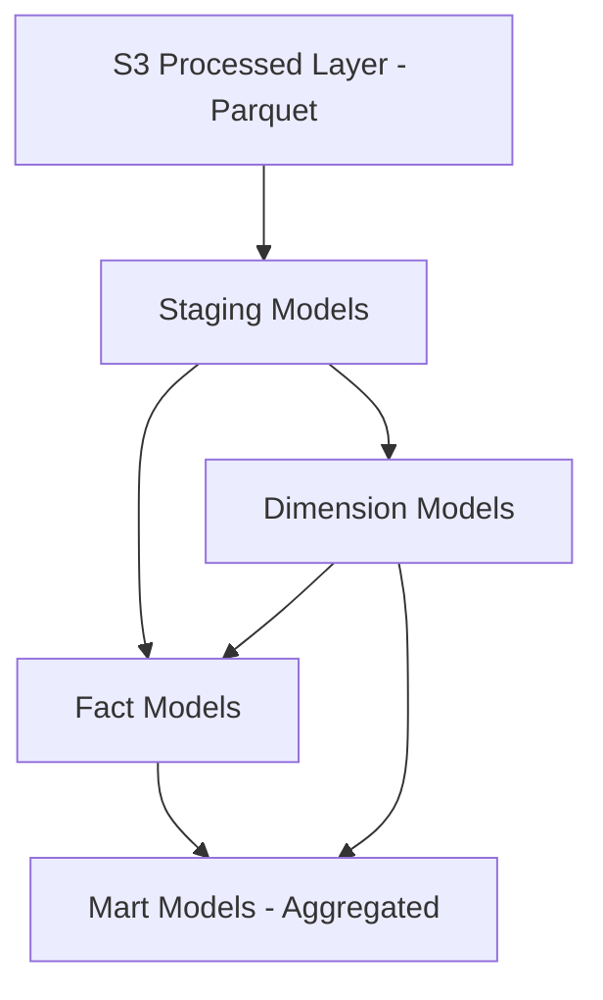
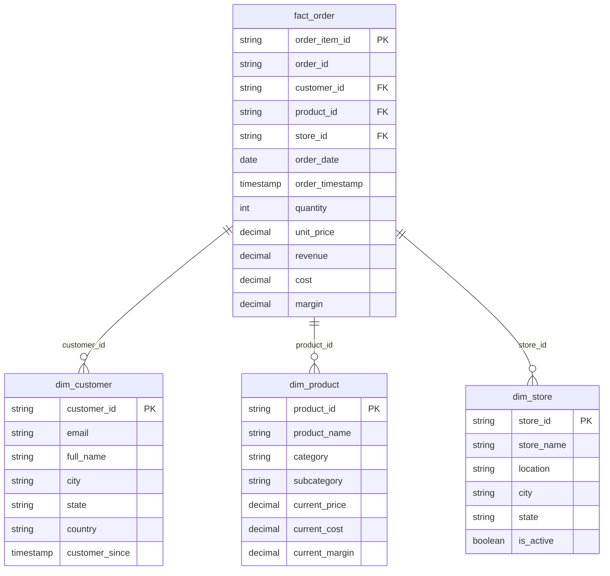

# Data Model

## Overview

CloudLake uses a dimensional model optimized for analytical queries. The model follows Kimball methodology with staging, dimension, fact, and mart layers.

## Architecture



## dbt Project Structure

```
dbt_project/
├── models/
│   ├── staging/
│   │   ├── _staging.yml
│   │   ├── stg_customers.sql
│   │   ├── stg_products.sql
│   │   ├── stg_stores.sql
│   │   ├── stg_orders.sql
│   │   └── stg_order_items.sql
│   ├── dimensions/
│   │   ├── _dimensions.yml
│   │   ├── dim_customer.sql
│   │   ├── dim_product.sql
│   │   └── dim_store.sql
│   ├── facts/
│   │   ├── _facts.yml
│   │   └── fact_order.sql
│   └── marts/
│       ├── _marts.yml
│       ├── mart_daily_sales.sql
│       ├── mart_product_performance.sql
│       ├── mart_customer_metrics.sql
│       └── mart_store_performance.sql
├── macros/
├── tests/
└── dbt_project.yml
```

## Staging Layer

### Purpose
- Standardize column names
- Apply basic type casting
- Minimal transformations
- 1:1 relationship with source tables
- Source of truth for downstream models

### stg_customers

```sql
-- Grain: One row per customer (current state)
-- Source: processed.customers

SELECT
    customer_id,
    email,
    first_name,
    last_name,
    city,
    state,
    country,
    created_at,
    updated_at
FROM {{ source('processed', 'customers') }}
```

### stg_products

```sql
-- Grain: One row per product (current state)
-- Source: processed.products

SELECT
    product_id,
    name AS product_name,
    category,
    subcategory,
    price,
    cost,
    created_at,
    updated_at
FROM {{ source('processed', 'products') }}
```

### stg_stores

```sql
-- Grain: One row per store
-- Source: processed.stores

SELECT
    store_id,
    store_name,
    city,
    state,
    country,
    opened_at,
    closed_at,
    CASE WHEN closed_at IS NULL THEN TRUE ELSE FALSE END AS is_active
FROM {{ source('processed', 'stores') }}
```

### stg_orders

```sql
-- Grain: One row per order
-- Source: processed.orders

SELECT
    order_id,
    customer_id,
    store_id,
    order_date,
    status,
    total_amount
FROM {{ source('processed', 'orders') }}
```

### stg_order_items

```sql
-- Grain: One row per order line item
-- Source: processed.order_items

SELECT
    order_item_id,
    order_id,
    product_id,
    quantity,
    unit_price,
    line_total
FROM {{ source('processed', 'order_items') }}
```

## Dimension Layer

### Purpose
- Business-friendly attributes
- Slowly Changing Dimension (SCD) logic if needed
- Conformed dimensions across facts
- Descriptive columns for filtering/grouping

### dim_customer

```sql
-- Grain: One row per customer (SCD Type 1 - current state only)
-- Attributes: Customer demographics, geography

SELECT
    customer_id,
    email,
    first_name,
    last_name,
    CONCAT(first_name, ' ', last_name) AS full_name,
    city,
    state,
    country,
    created_at AS customer_since,
    updated_at AS last_updated,
    DATEDIFF(day, created_at, CURRENT_DATE) AS days_as_customer
FROM {{ ref('stg_customers') }}
```

**SCD Strategy**: Type 1 (overwrite). Customer attributes change infrequently. Historical analysis uses facts at transaction time, not current dimension state.

### dim_product

```sql
-- Grain: One row per product (SCD Type 1)
-- Attributes: Product catalog details, pricing

SELECT
    product_id,
    product_name,
    category,
    subcategory,
    price AS current_price,
    cost AS current_cost,
    price - cost AS current_margin,
    CASE 
        WHEN price > 0 THEN (price - cost) / price * 100 
        ELSE 0 
    END AS margin_percent,
    created_at AS product_created_at,
    updated_at AS last_updated
FROM {{ ref('stg_products') }}
```

**Price history**: Not tracked in dimension. Order items capture historical unit_price at transaction time.

### dim_store

```sql
-- Grain: One row per store
-- Attributes: Store location, status

SELECT
    store_id,
    store_name,
    city,
    state,
    country,
    CONCAT(city, ', ', state) AS location,
    opened_at,
    closed_at,
    is_active,
    DATEDIFF(day, opened_at, COALESCE(closed_at, CURRENT_DATE)) AS days_operational
FROM {{ ref('stg_stores') }}
```

## Fact Layer

### fact_order

```sql
-- Grain: One row per order line item (atomic grain)
-- Measures: Quantity, revenue, margin
-- Dimensions: Customer, product, store, date

SELECT
    oi.order_item_id,
    oi.order_id,
    o.customer_id,
    o.store_id,
    oi.product_id,
    DATE(o.order_date) AS order_date,
    o.order_date AS order_timestamp,
    o.status,
    
    -- Measures
    oi.quantity,
    oi.unit_price,
    oi.line_total AS revenue,
    p.current_cost * oi.quantity AS cost,
    oi.line_total - (p.current_cost * oi.quantity) AS margin,
    
    -- Metadata
    o.total_amount AS order_total_amount
    
FROM {{ ref('stg_order_items') }} oi
INNER JOIN {{ ref('stg_orders') }} o ON oi.order_id = o.order_id
LEFT JOIN {{ ref('dim_product') }} p ON oi.product_id = p.product_id
```

**Grain justification**: Line item grain enables product-level analysis. Can aggregate to order grain when needed.

**Cost calculation**: Uses current product cost as approximation. True historical cost would require cost history tracking (future enhancement).

**Store_id nullable**: Online orders have null store_id. Dimension lookup handles this via LEFT JOIN or COALESCE in marts.

## Mart Layer

### Purpose
- Denormalized for specific analytical questions
- Pre-aggregated for query performance
- Business-friendly column names
- Minimal joins required for end users

### mart_daily_sales

```sql
-- Grain: One row per date, optionally by store/product/customer
-- Purpose: Daily revenue reporting, trend analysis

SELECT
    order_date,
    COUNT(DISTINCT order_id) AS order_count,
    COUNT(DISTINCT customer_id) AS customer_count,
    SUM(quantity) AS units_sold,
    SUM(revenue) AS total_revenue,
    SUM(cost) AS total_cost,
    SUM(margin) AS total_margin,
    AVG(revenue) AS avg_line_revenue,
    SUM(revenue) / NULLIF(COUNT(DISTINCT order_id), 0) AS avg_order_value
FROM {{ ref('fact_order') }}
WHERE status = 'complete'
GROUP BY order_date
```

### mart_product_performance

```sql
-- Grain: One row per product
-- Purpose: Product ranking, inventory decisions

SELECT
    p.product_id,
    p.product_name,
    p.category,
    p.subcategory,
    p.current_price,
    
    COUNT(DISTINCT f.order_id) AS order_count,
    SUM(f.quantity) AS total_units_sold,
    SUM(f.revenue) AS total_revenue,
    SUM(f.margin) AS total_margin,
    AVG(f.unit_price) AS avg_selling_price,
    
    -- Ranking
    RANK() OVER (ORDER BY SUM(f.revenue) DESC) AS revenue_rank,
    RANK() OVER (ORDER BY SUM(f.quantity) DESC) AS volume_rank
    
FROM {{ ref('dim_product') }} p
LEFT JOIN {{ ref('fact_order') }} f ON p.product_id = f.product_id AND f.status = 'complete'
GROUP BY p.product_id, p.product_name, p.category, p.subcategory, p.current_price
```

### mart_customer_metrics

```sql
-- Grain: One row per customer
-- Purpose: Customer segmentation, lifetime value

SELECT
    c.customer_id,
    c.full_name,
    c.email,
    c.city,
    c.state,
    c.country,
    c.customer_since,
    
    COUNT(DISTINCT f.order_id) AS total_orders,
    SUM(f.revenue) AS lifetime_value,
    AVG(f.revenue) AS avg_line_value,
    SUM(f.quantity) AS total_items_purchased,
    MIN(f.order_date) AS first_order_date,
    MAX(f.order_date) AS last_order_date,
    DATEDIFF(day, MAX(f.order_date), CURRENT_DATE) AS days_since_last_order,
    
    -- Segmentation
    CASE 
        WHEN COUNT(DISTINCT f.order_id) >= 10 THEN 'High Frequency'
        WHEN COUNT(DISTINCT f.order_id) >= 5 THEN 'Medium Frequency'
        WHEN COUNT(DISTINCT f.order_id) >= 1 THEN 'Low Frequency'
        ELSE 'No Orders'
    END AS frequency_segment,
    
    CASE
        WHEN SUM(f.revenue) >= 1000 THEN 'High Value'
        WHEN SUM(f.revenue) >= 500 THEN 'Medium Value'
        WHEN SUM(f.revenue) > 0 THEN 'Low Value'
        ELSE 'No Value'
    END AS value_segment
    
FROM {{ ref('dim_customer') }} c
LEFT JOIN {{ ref('fact_order') }} f ON c.customer_id = f.customer_id AND f.status = 'complete'
GROUP BY c.customer_id, c.full_name, c.email, c.city, c.state, c.country, c.customer_since
```

### mart_store_performance

```sql
-- Grain: One row per store, optionally per date
-- Purpose: Store comparison, geographic analysis

SELECT
    s.store_id,
    s.store_name,
    s.location,
    s.city,
    s.state,
    s.country,
    s.is_active,
    
    COUNT(DISTINCT f.order_id) AS order_count,
    COUNT(DISTINCT f.customer_id) AS customer_count,
    SUM(f.revenue) AS total_revenue,
    SUM(f.margin) AS total_margin,
    AVG(f.revenue) AS avg_line_revenue,
    
    -- Performance metrics
    SUM(f.revenue) / NULLIF(s.days_operational, 0) AS revenue_per_day,
    RANK() OVER (ORDER BY SUM(f.revenue) DESC) AS revenue_rank
    
FROM {{ ref('dim_store') }} s
LEFT JOIN {{ ref('fact_order') }} f ON s.store_id = f.store_id AND f.status = 'complete'
GROUP BY s.store_id, s.store_name, s.location, s.city, s.state, s.country, s.is_active, s.days_operational
```

**Online orders**: Excluded from store performance (store_id IS NULL). Separate mart or filter can analyze online channel.

## Star Schema Diagram



## Intermediate Models

**Not included** in initial design. Intermediate layer useful when:
- Complex business logic reused across multiple marts
- Incremental models need pre-aggregation
- Debugging requires step-by-step transformation visibility

Current design: Staging → Dimensions/Facts → Marts is sufficient. Add intermediate models if complexity justifies.

## Incremental Models

**Not used initially**. All models are full-refresh.

Rationale:
- Data volume is small (10K orders/day = ~300MB/day Parquet)
- Full-refresh completes in minutes
- Simpler debugging and development
- No incremental logic bugs

Upgrade path:
- If dbt run time exceeds 15 minutes, convert fact_order to incremental
- If mart rebuilds become expensive, convert large marts to incremental
- Use `is_incremental()` macro with order_date filter

## Materialization Strategy

| Model Type | Materialization | Reason |
|------------|-----------------|--------|
| Staging    | View            | Lightweight, no duplication, only used by downstream models |
| Dimensions | Table           | Small data, frequently joined, cache for performance |
| Facts      | Table           | Large data, expensive to recompute, base for marts |
| Marts      | Table           | Pre-aggregated, queried by analysts, performance critical |

Alternative considered:
- Ephemeral staging: Inlines SQL, harder to debug, marginal performance gain
- View dimensions: Repeated computation in every mart join

## SCD Strategy

**Type 1 (Overwrite)** for all dimensions.

Rationale:
- Historical product price captured in fact_order.unit_price
- Customer/store attribute changes are rare
- No business requirement for dimension history
- Type 2 complexity not justified for portfolio scope

Upgrade path:
- If historical dimension analysis required, implement SCD Type 2 for dim_product
- Add valid_from, valid_to, is_current columns
- Surrogate key for dimension history

## Naming Conventions

- **Staging**: `stg_{source_table}`
- **Dimensions**: `dim_{entity}`
- **Facts**: `fact_{process}` (e.g., fact_order, fact_shipment)
- **Marts**: `mart_{business_area}` (e.g., mart_daily_sales)
- **Columns**: snake_case
- **Primary keys**: `{entity}_id`
- **Foreign keys**: `{referenced_entity}_id`
- **Measures**: descriptive noun (revenue, quantity, margin)
- **Dates**: `{entity}_date` or `{event}_date`

## dbt Tests

See [DATA_QUALITY.md](DATA_QUALITY.md) for comprehensive testing strategy.

Minimum tests per layer:
- **Staging**: `not_null` on primary keys, `unique` on primary keys
- **Dimensions**: `not_null` and `unique` on primary keys, `accepted_values` for categoricals
- **Facts**: `not_null` on primary keys and foreign keys, `relationships` to dimensions
- **Marts**: Custom data tests for business logic

## Query Patterns

Typical analyst queries:

**Daily sales trend**:
```sql
SELECT order_date, total_revenue, order_count
FROM analytics.mart_daily_sales
ORDER BY order_date DESC
LIMIT 30;
```

**Top products**:
```sql
SELECT product_name, category, total_revenue, revenue_rank
FROM analytics.mart_product_performance
WHERE revenue_rank <= 10
ORDER BY revenue_rank;
```

**Customer segmentation**:
```sql
SELECT frequency_segment, value_segment, COUNT(*) AS customer_count
FROM analytics.mart_customer_metrics
GROUP BY frequency_segment, value_segment;
```

**Store comparison**:
```sql
SELECT store_name, location, total_revenue, revenue_rank
FROM analytics.mart_store_performance
WHERE is_active = TRUE
ORDER BY revenue_rank;
```

No joins required. Marts are denormalized for direct query.

## Data Freshness

- **Staging/Dimensions/Facts**: Refreshed after Glue job completes (daily)
- **Marts**: Refreshed immediately after facts (same dbt run)
- **End-to-end latency**: Source data → available in marts within 2 hours (ingestion + processing + dbt)

## Model Dependencies

```
stg_* (views, source data)
    ↓
dim_* (tables)
    ↓
fact_order (table, joins staging + dims)
    ↓
mart_* (tables, aggregate facts + dims)
```

dbt handles dependency resolution via `ref()` function.

## Performance Optimization

- Partitioning: All Athena tables partitioned by date
- File format: Parquet with Snappy compression
- Column pruning: SELECT only required columns
- Predicate pushdown: WHERE clauses on partition keys
- Pre-aggregation: Marts reduce join complexity for analysts

No secondary indexes (not supported in Athena). Query performance via partitioning and columnar format.
