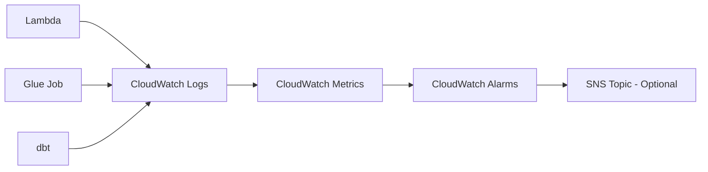

# Observability Strategy

## Observability Philosophy

Observability answers three questions:
1. **Is the pipeline running?** (health check)
2. **Did it succeed or fail?** (status)
3. **Why did it fail?** (diagnostics)

CloudLake uses CloudWatch for centralized logging, metrics, and alerting.

## Observability Architecture



## Logging Strategy

### Lambda Logging

**Automatic logs**:
- Lambda execution start/end
- Memory usage
- Duration
- Errors (stack traces)

**Custom logs** (application code):

```python
import logging
import json
from datetime import datetime

logger = logging.getLogger()
logger.setLevel(logging.INFO)

def lambda_handler(event, context):
    run_id = context.aws_request_id
    
    logger.info(json.dumps({
        'event': 'ingestion_start',
        'run_id': run_id,
        'timestamp': datetime.utcnow().isoformat(),
        'source': 'customers_api'
    }))
    
    try:
        # Fetch data
        response = fetch_api_data()
        record_count = len(response)
        
        logger.info(json.dumps({
            'event': 'data_fetched',
            'run_id': run_id,
            'record_count': record_count,
            'http_status': 200
        }))
        
        # Validate
        valid_records = validate_records(response)
        rejected_count = record_count - len(valid_records)
        
        if rejected_count > 0:
            logger.warning(json.dumps({
                'event': 'validation_warning',
                'run_id': run_id,
                'rejected_count': rejected_count,
                'rejection_rate': rejected_count / record_count
            }))
        
        # Write to S3
        s3_path = write_to_s3(valid_records, run_id)
        
        logger.info(json.dumps({
            'event': 'ingestion_complete',
            'run_id': run_id,
            's3_path': s3_path,
            'records_written': len(valid_records),
            'duration_ms': ...
        }))
        
        return {'status': 'success', 'records': len(valid_records)}
        
    except Exception as e:
        logger.error(json.dumps({
            'event': 'ingestion_failed',
            'run_id': run_id,
            'error': str(e),
            'error_type': type(e).__name__
        }))
        raise
```

**Log format**: Structured JSON for parsing

**Log group**: `/aws/lambda/cloudlake-ingestion-{entity}`

**Retention**: 14 days (balance cost vs debugging needs)

### Glue Job Logging

**Automatic logs**:
- Job start/end
- Worker allocation
- Job status (succeeded/failed/timeout)
- Error messages

**Custom logs** (PySpark code):

```python
import sys
from awsglue.utils import getResolvedOptions
from pyspark.context import SparkContext
from awsglue.context import GlueContext
from awsglue.job import Job
import logging

args = getResolvedOptions(sys.argv, ['JOB_NAME', 'date', 'entity'])
sc = SparkContext()
glueContext = GlueContext(sc)
spark = glueContext.spark_session
job = Job(glueContext)
job.init(args['JOB_NAME'], args)

logger = logging.getLogger(__name__)

logger.info(f"Starting processing for {args['entity']} on {args['date']}")

# Read raw data
input_path = f"s3://cloudlake-data/raw/{args['entity']}/year={year}/month={month}/day={day}/"
raw_df = spark.read.json(input_path)
input_count = raw_df.count()

logger.info(f"Read {input_count} records from {input_path}")

# Validate
validated_df = validate_schema(raw_df)
valid_count = validated_df.count()
rejected_count = input_count - valid_count

if rejected_count > 0:
    logger.warning(f"Rejected {rejected_count} records ({rejected_count/input_count*100:.2f}%)")

# Write Parquet
output_path = f"s3://cloudlake-data/processed/{args['entity']}/year={year}/month={month}/day={day}/"
validated_df.write.mode('overwrite').parquet(output_path)

logger.info(f"Wrote {valid_count} records to {output_path}")

job.commit()
```

**Log group**: `/aws-glue/jobs/output` (default) or custom `/aws-glue/cloudlake/{entity}`

**Retention**: 14 days

### dbt Logging

**Automatic logs**:
- Model execution order
- Compiled SQL
- Row counts
- Test results
- Execution time per model

**dbt output**:
```
14:30:12  Running with dbt=1.5.0
14:30:13  Found 12 models, 45 tests, 0 snapshots
14:30:15  Concurrency: 4 threads
14:30:16  1 of 12 START sql table model analytics.stg_customers ......... [RUN]
14:30:18  1 of 12 OK created sql table model analytics.stg_customers .... [SUCCESS in 2.1s]
14:30:18  2 of 12 START sql table model analytics.dim_customer .......... [RUN]
```

**Redirect to CloudWatch**:
- Run dbt in Lambda or EC2/Fargate (future)
- Capture stdout/stderr
- Send to CloudWatch Logs via CloudWatch agent or direct API

**Alternatively**: Store dbt logs in S3
```
s3://cloudlake-data/logs/dbt/{date}/dbt.log
s3://cloudlake-data/logs/dbt/{date}/run_results.json
```

**Log group**: `/aws/dbt/cloudlake`

**Retention**: 30 days (test results valuable for historical analysis)

## Metrics Strategy

### Lambda Metrics (Automatic)

AWS provides:
- `Invocations`: Count of Lambda invocations
- `Errors`: Count of errors
- `Duration`: Execution time
- `Throttles`: Count of throttled requests
- `ConcurrentExecutions`: Concurrent invocations

### Lambda Custom Metrics

Publish custom metrics via boto3:

```python
import boto3
cloudwatch = boto3.client('cloudwatch')

cloudwatch.put_metric_data(
    Namespace='CloudLake/Ingestion',
    MetricData=[
        {
            'MetricName': 'RecordsIngested',
            'Value': record_count,
            'Unit': 'Count',
            'Timestamp': datetime.utcnow(),
            'Dimensions': [
                {'Name': 'Entity', 'Value': 'customers'},
                {'Name': 'Environment', 'Value': 'prod'}
            ]
        },
        {
            'MetricName': 'RejectionRate',
            'Value': rejected_count / record_count * 100,
            'Unit': 'Percent',
            'Dimensions': [
                {'Name': 'Entity', 'Value': 'customers'}
            ]
        }
    ]
)
```

**Key custom metrics**:
- `RecordsIngested`: Count per entity
- `RecordsFailed`: Count of rejected records
- `RejectionRate`: Percentage
- `IngestionDuration`: Milliseconds

### Glue Job Metrics (Automatic)

AWS provides:
- `glue.driver.aggregate.numFailedTasks`
- `glue.driver.aggregate.numCompletedTasks`
- `glue.ALL.jvm.heap.usage`
- `glue.driver.BlockManager.disk.diskSpaceUsed_MB`

### Glue Custom Metrics

Publish via CloudWatch API (similar to Lambda):

**Key custom metrics**:
- `RecordsProcessed`: Count per entity
- `ProcessingDuration`: Seconds
- `DataQualityScore`: Percentage of valid records
- `PartitionSize`: MB written to S3

### dbt Metrics

Extract from `run_results.json`:

```json
{
  "results": [
    {
      "unique_id": "model.cloudlake.fact_order",
      "status": "success",
      "execution_time": 12.34,
      "rows_affected": 100000
    }
  ]
}
```

Parse and publish:
- `ModelExecutionTime`: Seconds per model
- `RowsAffected`: Count per model
- `TestsPassed`: Count
- `TestsFailed`: Count

### Metric Aggregation

**Daily rollup query** (Athena on CloudWatch Logs Insights export):
```sql
SELECT
    date,
    entity,
    SUM(records_ingested) AS total_ingested,
    AVG(rejection_rate) AS avg_rejection_rate,
    MAX(ingestion_duration) AS max_duration
FROM cloudwatch_metrics
WHERE namespace = 'CloudLake/Ingestion'
  AND date >= CURRENT_DATE - INTERVAL '30' DAY
GROUP BY date, entity
ORDER BY date DESC, entity;
```

## Alerting Strategy

### CloudWatch Alarms

**Alarm philosophy**: Alert on actionable failures, not noise.

### Lambda Ingestion Alarms

**Alarm: Ingestion Failure**
- Metric: `Errors`
- Threshold: >= 1 in 5 minutes
- Evaluation periods: 1
- Action: SNS notification (optional)
- Rationale: Any Lambda error indicates ingestion failure

**Alarm: High Rejection Rate**
- Metric: Custom `RejectionRate`
- Threshold: >= 5%
- Evaluation periods: 1
- Action: SNS notification
- Rationale: High rejection suggests schema change or data quality issue

**Alarm: No Ingestion (Freshness)**
- Metric: Custom `RecordsIngested`
- Threshold: No datapoints in 26 hours
- Action: SNS notification
- Rationale: Daily job missed

### Glue Job Alarms

**Alarm: Glue Job Failure**
- Metric: Custom CloudWatch metric from Glue job state change event
- Threshold: Job state = FAILED
- Action: SNS notification
- Rationale: Processing failure prevents downstream analytics

**Alarm: Processing Duration Anomaly**
- Metric: Custom `ProcessingDuration`
- Threshold: > 2x rolling 7-day average
- Evaluation periods: 2
- Action: SNS notification
- Rationale: May indicate data volume spike or performance regression

### dbt Alarms

**Alarm: dbt Test Failure**
- Metric: Custom `TestsFailed`
- Threshold: >= 1
- Action: SNS notification
- Rationale: Data quality issue detected

**Alarm: dbt Run Failure**
- Metric: Custom `dbtRunStatus` (0=success, 1=fail)
- Threshold: = 1
- Action: SNS notification
- Rationale: Transformation pipeline broken

### Cost Alarms

**Alarm: Daily Cost Exceeds Budget**
- Metric: AWS Cost Explorer metric (via CloudWatch)
- Threshold: > $5/day
- Action: SNS notification
- Rationale: Unexpected resource usage

**Note**: Cost metrics have 24h delay. Not real-time.

## SNS Notification Strategy

**Phase 0 decision**: SNS optional initially.

Alarms can fire without SNS (visible in CloudWatch console). Manual monitoring acceptable for portfolio development.

**When to add SNS**:
- Continuous operation mode
- Email/SMS notifications desired
- Integration with Slack/PagerDuty/etc.

**SNS topic structure**:
```
cloudlake-alerts-critical   (ingestion/processing failures)
cloudlake-alerts-warning    (quality issues, performance anomalies)
cloudlake-alerts-info       (daily summary)
```

## Correlation and Run ID

### Run ID Propagation

Lambda generates UUID `run_id` on invocation:
```python
run_id = str(uuid.uuid4())
```

Pass through pipeline:
1. **Lambda → S3**: Include in object key and metadata
2. **S3 → Glue**: Glue job reads S3 metadata, extracts run_id
3. **Glue → Logs**: Include run_id in all log messages
4. **dbt**: (Future) Accept run_id as environment variable, include in logs

### Log Correlation

Query CloudWatch Logs Insights to trace run:
```
fields @timestamp, @message
| filter run_id = "abc-123-def"
| sort @timestamp asc
```

Reveals entire pipeline execution for single run.

### Partition Date Correlation

Simpler approach: Correlate by partition date instead of run_id.

Query all logs for date=2026-09-14:
- Lambda logs with timestamp 2026-09-14
- Glue logs processing partition year=2026/month=09/day=14
- dbt logs running on 2026-09-14

Less precise but sufficient for daily batch pipeline.

## Dashboards

**Phase 0 decision**: No CloudWatch dashboards initially. Create in later phase.

**Proposed dashboard structure**:

**Dashboard: Pipeline Health**
- Widgets:
  - Ingestion success rate (last 7 days)
  - Processing success rate (last 7 days)
  - dbt test pass rate (last 7 days)
  - Data freshness (hours since last update)
  - Daily record counts (line chart)

**Dashboard: Data Quality**
- Widgets:
  - Rejection rate by entity (bar chart)
  - Failed dbt tests (count)
  - Quality score trend (line chart)

**Dashboard: Performance**
- Widgets:
  - Lambda duration (p50, p95, p99)
  - Glue job duration (line chart)
  - dbt execution time (bar chart per model)

**Dashboard: Cost**
- Widgets:
  - Daily cost by service (stacked area)
  - S3 storage growth (line chart)
  - Athena query cost (daily sum)

**Cost**: $3/dashboard/month. Budget 1-2 dashboards = ~$6/month.

## Debugging Workflows

### Scenario: Ingestion Failed

1. Check CloudWatch alarm (if configured)
2. Navigate to Lambda logs: `/aws/lambda/cloudlake-ingestion-customers`
3. Filter by recent timeframe
4. Search for `"event": "ingestion_failed"`
5. Inspect error message and stack trace
6. Identify root cause (API down, schema change, etc.)

### Scenario: Processing Produced Zero Records

1. Check Glue job logs: `/aws-glue/jobs/output`
2. Search for `RecordsProcessed` metric or log message
3. Identify input path
4. Check S3 for raw files in that partition
5. If raw files exist, debug Glue job validation logic
6. If raw files missing, trace back to Lambda ingestion

### Scenario: dbt Test Failed

1. Check dbt logs (S3 or CloudWatch)
2. Identify failed test name (e.g., `unique_customer_id`)
3. Run dbt locally with `--debug` flag
4. Query Athena to inspect failing records:
   ```sql
   SELECT customer_id, COUNT(*) 
   FROM analytics.dim_customer 
   GROUP BY customer_id 
   HAVING COUNT(*) > 1;
   ```
5. Trace duplicate customer_id back to processed layer
6. Trace to raw layer
7. Identify root cause (duplicate ingestion, processing bug, source data issue)

### Scenario: Query Performance Degraded

1. Check Athena query history
2. Identify slow query
3. Check query execution details:
   - Data scanned
   - Execution time
   - Partition pruning effectiveness
4. If full table scan: add partition filter
5. If partition count exploded: investigate ingestion frequency
6. If file count too high: compact small files

## Log Retention and Cost

| Log Group | Retention | Monthly Volume (Est) | Cost (Est) |
|-----------|-----------|----------------------|------------|
| Lambda ingestion | 14 days | 100 MB | $0.05 |
| Glue jobs | 14 days | 200 MB | $0.10 |
| dbt | 30 days | 50 MB | $0.025 |
| **Total** | | 350 MB | **$0.175** |

**Assumptions**:
- Daily pipeline executions
- Moderate logging verbosity
- CloudWatch Logs: $0.50/GB ingestion, $0.03/GB storage

**Cost control**:
- Use structured JSON logs (compact)
- Avoid logging large payloads (log record count, not full records)
- Set aggressive retention (7-30 days)
- Archive critical logs to S3 (cheaper long-term storage)

## Monitoring Checklist

Daily (automated alarms handle this):
- [ ] Ingestion succeeded for all entities
- [ ] Processing succeeded for all entities
- [ ] dbt tests passed
- [ ] No CloudWatch alarms firing

Weekly (manual review):
- [ ] Review rejection rate trends
- [ ] Review processing duration trends
- [ ] Check for new error patterns in logs
- [ ] Verify data freshness

Monthly (manual review):
- [ ] Review AWS cost by service
- [ ] Evaluate alarm effectiveness (false positives?)
- [ ] Update log retention policies if needed
- [ ] Audit CloudWatch dashboard relevance

## Observability Roadmap

**Phase 7** (Observability implementation):
1. Implement structured logging in Lambda
2. Implement structured logging in Glue
3. Create CloudWatch alarms (ingestion, processing, quality)
4. Publish custom metrics
5. Test alarm firing with simulated failures
6. Document runbook procedures

**Phase 8** (Observability enhancement):
1. Create CloudWatch dashboards
2. Implement SNS notifications
3. Add dbt logging to CloudWatch
4. Set up cost anomaly detection
5. Create weekly summary report (automated Athena query)

## Trade-offs

**Not implemented** (too expensive or complex):
- Third-party APM (Datadog, New Relic): $15-100/month
- AWS X-Ray: Adds tracing cost, minimal benefit for batch pipeline
- OpenTelemetry: Overkill for serverless batch architecture
- Custom metrics for every data point: CloudWatch Metrics cost ($0.30/metric/month)

**Implemented** (appropriate for scope):
- CloudWatch Logs (native AWS integration)
- CloudWatch Alarms (free tier: 10 alarms)
- Custom metrics for critical KPIs only
- Structured JSON logs for query flexibility

**Principle**: Use native observability tools. Avoid third-party SaaS unless clear justification.
